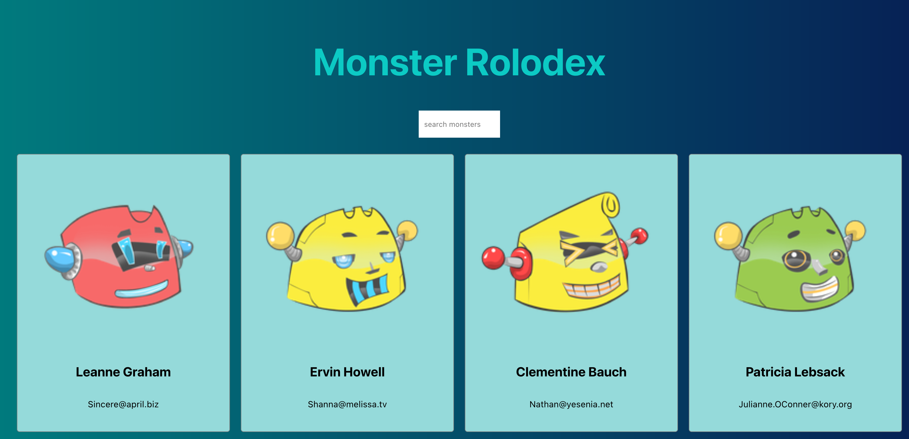
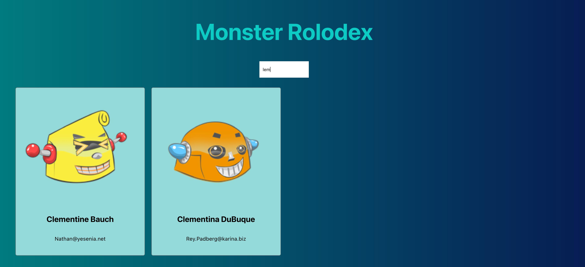

# Monster Rolodex

This is a React implementation for a Monster Rolodex.
You can type in the name of a monster in the search bar, the name cards for monsters having matching name will be updated accordingly.

### Before Search
All Monster Cards will show up.

### After Search
Monster Cards with matching name will show up.

